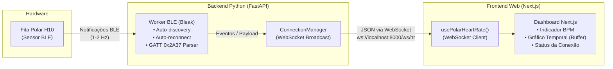

# Relatório de Implementação: Pipeline de Dados em Tempo Real (Polar H10 + FastAPI + WebSockets + Next.js)

## 1. Visão Geral da Arquitetura

O objetivo desta solução é desacoplar a camada de hardware (Bluetooth Low Energy) da interface com o usuário (Web moderna), substituindo o modelo desktop legado (Tkinter/LSL) por uma arquitetura cliente-servidor em tempo real.



### Vantagens Desta Abordagem
- **Independência de Plataforma**: O backend pode rodar localmente no computador do usuário ou em um dispositivo dedicado (como um Raspberry Pi / micro PC de laboratório), enquanto o Next.js pode ser acessado de qualquer navegador.
- **Assincronia Nativa**: Tanto o `bleak` quanto o `FastAPI` utilizam o loop de eventos `asyncio` nativo do Python, eliminando problemas de concorrência e o uso desordenado de threads.
- **Multitela / Broadcast**: Múltiplas abas ou dispositivos podem assistir à mesma transmissão cardíaca simultaneamente sem criar novas conexões Bluetooth com a fita.

---

## 2. Implementação do Backend (FastAPI + Bleak)

### 2.1 Dependências do Backend (`requirements.txt`)
```text
fastapi>=0.110.0
uvicorn[standard]>=0.28.0
bleak>=0.21.1
websockets>=12.0
```

### 2.2 Estrutura de Arquivos Recomendada
```
backend/
├── main.py              # Aplicação FastAPI e rotas HTTP/WebSocket
├── polar_worker.py      # Gerenciador de conexão BLE e decodificação
└── requirements.txt     # Dependências Python
```

### 2.3 Decodificador e Worker BLE ([`backend/polar_worker.py`](file:///home/guicaldana/Downloads/Polar-Recorder-and-LSL-Restream-master/backend/polar_worker.py))
Este módulo isola o ciclo de vida do Bluetooth. Ele lida com busca de dispositivos, decodificação dos bytes de acordo com o padrão Bluetooth SIG e reconexão automática caso a fita saia de alcance ou seja retirada do peito.

```python
import asyncio
import struct
import time
from typing import Callable, Optional
from bleak import BleakScanner, BleakClient

# UUID oficial GATT para Heart Rate Measurement
HR_MEASUREMENT_UUID = "00002a37-0000-1000-8000-00805f9b34fb"

def parse_heart_rate_data(data: bytearray) -> dict:
    """
    Decodifica o pacote binário GATT 0x2A37.
    - Bit 0: Formato de FC (0 = UINT8, 1 = UINT16)
    - Bit 4: Presença de intervalos RR
    """
    flags = data[0]
    hr_format = (flags & 0x01) == 0x01
    has_rr = (flags & 0x10) == 0x10

    if hr_format:
        hr_value = struct.unpack('<H', data[1:3])[0]
        offset = 3
    else:
        hr_value = data[1]
        offset = 2

    rr_intervals = []
    if has_rr:
        # Cada intervalo RR possui 2 bytes (em unidades de 1/1024 segundos)
        num_rr = (len(data) - offset) // 2
        for i in range(num_rr):
            raw_rr = struct.unpack('<H', data[offset + i*2 : offset + i*2 + 2])[0]
            rr_ms = round((raw_rr / 1024) * 1000, 2)
            rr_intervals.append(rr_ms)

    return {
        "type": "data",
        "heart_rate": hr_value,
        "rr_intervals": rr_intervals,
        "timestamp": time.time()
    }

class PolarBleWorker:
    def __init__(self, broadcast_callback: Callable[[dict], asyncio.Future]):
        self.broadcast_callback = broadcast_callback
        self.client: Optional[BleakClient] = None
        self.is_running = False
        self.device_name: Optional[str] = None
        self.device_address: Optional[str] = None

    async def start(self):
        self.is_running = True
        asyncio.create_task(self._connection_loop())

    async def stop(self):
        self.is_running = False
        if self.client and self.client.is_connected:
            await self.client.disconnect()

    async def _connection_loop(self):
        while self.is_running:
            try:
                await self.broadcast_callback({
                    "type": "status",
                    "status": "scanning",
                    "message": "Procurando dispositivo Polar..."
                })

                # Escaneia procurando dispositivo com 'Polar' no nome
                device = await BleakScanner.find_device_by_filter(
                    lambda d, adv: d.name and "Polar" in d.name,
                    timeout=5.0
                )

                if not device:
                    await self.broadcast_callback({
                        "type": "status",
                        "status": "not_found",
                        "message": "Polar H10 não encontrada. Nova tentativa em 3s..."
                    })
                    await asyncio.sleep(3.0)
                    continue

                self.device_name = device.name
                self.device_address = device.address

                await self.broadcast_callback({
                    "type": "status",
                    "status": "connecting",
                    "device": self.device_name,
                    "address": self.device_address,
                    "message": f"Conectando a {self.device_name}..."
                })

                async with BleakClient(device.address) as client:
                    self.client = client
                    
                    await self.broadcast_callback({
                        "type": "status",
                        "status": "connected",
                        "device": self.device_name,
                        "address": self.device_address,
                        "message": "Conectado e recebendo dados."
                    })

                    def on_notification(sender, data: bytearray):
                        payload = parse_heart_rate_data(data)
                        # Dispara envio assíncrono para a fila do WebSocket
                        asyncio.create_task(self.broadcast_callback(payload))

                    await client.start_notify(HR_MEASUREMENT_UUID, on_notification)

                    # Mantém a sessão ativa enquanto conectado
                    while client.is_connected and self.is_running:
                        await asyncio.sleep(1.0)

            except Exception as e:
                await self.broadcast_callback({
                    "type": "status",
                    "status": "error",
                    "message": f"Erro BLE: {str(e)}. Reconectando..."
                })
                await asyncio.sleep(3.0)
```

### 2.4 Servidor Principal e WebSocket ([`backend/main.py`](file:///home/guicaldana/Downloads/Polar-Recorder-and-LSL-Restream-master/backend/main.py))

```python
import asyncio
from typing import Set
from fastapi import FastAPI, WebSocket, WebSocketDisconnect
from fastapi.middleware.cors import CORSMiddleware
from polar_worker import PolarBleWorker

app = FastAPI(title="Polar H10 Realtime API")

# Libera chamadas do Next.js (localhost:3000 por padrão)
app.add_middleware(
    CORSMiddleware,
    allow_origins=["*"],
    allow_credentials=True,
    allow_methods=["*"],
    allow_headers=["*"],
)

class ConnectionManager:
    def __init__(self):
        self.active_connections: Set[WebSocket] = set()

    async def connect(self, websocket: WebSocket):
        await websocket.accept()
        self.active_connections.add(websocket)

    def disconnect(self, websocket: WebSocket):
        self.active_connections.discard(websocket)

    async def broadcast(self, message: dict):
        # Envia a mensagem a todos os clientes conectados
        disconnected = set()
        for connection in self.active_connections:
            try:
                await connection.send_json(message)
            except Exception:
                disconnected.add(connection)
        
        for dead_conn in disconnected:
            self.active_connections.discard(dead_conn)

manager = ConnectionManager()
worker = PolarBleWorker(broadcast_callback=manager.broadcast)

@app.on_event("startup")
async def startup():
    await worker.start()

@app.on_event("shutdown")
async def shutdown():
    await worker.stop()

@app.get("/health")
async def health():
    return {
        "status": "online",
        "active_ws_clients": len(manager.active_connections),
        "device": worker.device_name
    }

@app.websocket("/ws/hr")
async def websocket_heart_rate(websocket: WebSocket):
    await manager.connect(websocket)
    try:
        while True:
            # Mantém a conexão aberta aguardando mensagens ou ping/pong
            await websocket.receive_text()
    except WebSocketDisconnect:
        manager.disconnect(websocket)
```

---

## 3. Implementação do Frontend (Next.js)

### 3.1 Hook Customizado: `usePolarHeartRate.ts`
Gerencia a conexão do WebSocket, reconexão automática em caso de queda de rede e histórico com buffer em janela deslizante para alimentar gráficos.

```typescript
// hooks/usePolarHeartRate.ts
'use client';

import { useState, useEffect, useRef } from 'react';

export interface DataPoint {
  timestamp: number;
  timeFormatted: string;
  heartRate: number;
  rrIntervals: number[];
}

export interface DeviceStatus {
  status: 'scanning' | 'connecting' | 'connected' | 'not_found' | 'error' | 'disconnected';
  message: string;
  device?: string;
}

export function usePolarHeartRate(wsUrl: string = 'ws://localhost:8000/ws/hr', maxBufferPoints = 50) {
  const [currentHR, setCurrentHR] = useState<number | null>(null);
  const [deviceStatus, setDeviceStatus] = useState<DeviceStatus>({
    status: 'disconnected',
    message: 'Aguardando conexão com API...'
  });
  const [history, setHistory] = useState<DataPoint[]>([]);
  const wsRef = useRef<WebSocket | null>(null);

  useEffect(() => {
    let reconnectTimeout: NodeJS.Timeout;

    const connectWebSocket = () => {
      const ws = new WebSocket(wsUrl);
      wsRef.current = ws;

      ws.onopen = () => {
        setDeviceStatus({ status: 'connecting', message: 'Conectado à API. Aguardando dados...' });
      };

      ws.onmessage = (event) => {
        try {
          const payload = JSON.parse(event.data);

          if (payload.type === 'status') {
            setDeviceStatus({
              status: payload.status,
              message: payload.message,
              device: payload.device
            });
          } else if (payload.type === 'data') {
            const hr = payload.heart_rate;
            const timeFormatted = new Date(payload.timestamp * 1000).toLocaleTimeString();

            setCurrentHR(hr);
            setHistory((prev) => {
              const updated = [
                ...prev,
                {
                  timestamp: payload.timestamp,
                  timeFormatted,
                  heartRate: hr,
                  rrIntervals: payload.rr_intervals || []
                }
              ];
              return updated.length > maxBufferPoints ? updated.slice(-maxBufferPoints) : updated;
            });
          }
        } catch (e) {
          console.error('Erro ao processar mensagem do WebSocket:', e);
        }
      };

      ws.onclose = () => {
        setDeviceStatus({ status: 'disconnected', message: 'Conexão perdida com a API. Tentando em 3s...' });
        reconnectTimeout = setTimeout(connectWebSocket, 3000);
      };

      ws.onerror = (err) => {
        console.error('Erro no WebSocket:', err);
        ws.close();
      };
    };

    connectWebSocket();

    return () => {
      clearTimeout(reconnectTimeout);
      if (wsRef.current) {
        wsRef.current.close();
      }
    };
  }, [wsUrl, maxBufferPoints]);

  return { currentHR, deviceStatus, history };
}
```

### 3.2 Componente de Dashboard (`components/HeartRateDashboard.tsx`)
Exibe a frequência atual, badge de status e um gráfico leve em SVG/HTML sem dependências pesadas adicionais (ou integrável com Recharts).

```tsx
// components/HeartRateDashboard.tsx
'use client';

import React from 'react';
import { usePolarHeartRate } from '@/hooks/usePolarHeartRate';

export default function HeartRateDashboard() {
  const { currentHR, deviceStatus, history } = usePolarHeartRate();

  const getStatusBadge = () => {
    switch (deviceStatus.status) {
      case 'connected':
        return <span className="px-3 py-1 bg-green-500/20 text-green-400 rounded-full text-sm font-medium">● Conectado ({deviceStatus.device || 'Polar H10'})</span>;
      case 'scanning':
      case 'connecting':
        return <span className="px-3 py-1 bg-yellow-500/20 text-yellow-400 rounded-full text-sm font-medium animate-pulse">◌ {deviceStatus.message}</span>;
      default:
        return <span className="px-3 py-1 bg-red-500/20 text-red-400 rounded-full text-sm font-medium">✕ {deviceStatus.message}</span>;
    }
  };

  return (
    <div className="max-w-4xl mx-auto p-6 space-y-6 text-white bg-slate-900 rounded-2xl border border-slate-800 shadow-2xl">
      {/* Cabeçalho */}
      <div className="flex justify-between items-center pb-4 border-b border-slate-800">
        <div>
          <h1 className="text-2xl font-bold">Monitor Fisiológico Polar H10</h1>
          <p className="text-slate-400 text-sm">Streaming ao vivo via WebSocket</p>
        </div>
        <div>{getStatusBadge()}</div>
      </div>

      {/* Destaque da Frequência Cardíaca */}
      <div className="grid grid-cols-1 md:grid-cols-3 gap-4">
        <div className="md:col-span-1 bg-slate-800/60 p-6 rounded-xl border border-slate-700/50 flex flex-col items-center justify-center">
          <span className="text-slate-400 text-sm uppercase tracking-wider font-semibold">Frequência Cardíaca</span>
          <div className="flex items-baseline space-x-2 mt-2">
            <span className="text-7xl font-extrabold text-red-500 tracking-tight">
              {currentHR !== null ? currentHR : '--'}
            </span>
            <span className="text-xl text-slate-400 font-medium">BPM</span>
          </div>
          {deviceStatus.status === 'connected' && (
            <div className="mt-3 flex items-center space-x-1.5 text-xs text-green-400">
              <span className="h-2 w-2 rounded-full bg-green-400 animate-ping" />
              <span>Sinal ativo</span>
            </div>
          )}
        </div>

        {/* Informações Rápidas de Sessão */}
        <div className="md:col-span-2 bg-slate-800/60 p-6 rounded-xl border border-slate-700/50 flex flex-col justify-around">
          <div className="flex justify-between text-sm text-slate-400">
            <span>Pontos no buffer: <strong className="text-white">{history.length}</strong></span>
            <span>Último RR: <strong className="text-white">
              {history.length > 0 && history[history.length - 1].rrIntervals.length > 0
                ? `${history[history.length - 1].rrIntervals.slice(-1)[0]} ms`
                : '--'}
            </strong></span>
          </div>

          {/* Gráfico Simples de Tendência com Canvas/SVG */}
          <div className="h-28 w-full flex items-end gap-1 pt-4 border-t border-slate-700/40">
            {history.map((pt, idx) => {
              const heightPct = Math.min(100, Math.max(10, ((pt.heartRate - 40) / 140) * 100));
              return (
                <div
                  key={idx}
                  title={`${pt.timeFormatted}: ${pt.heartRate} BPM`}
                  className="flex-1 bg-red-500/80 hover:bg-red-400 transition-all rounded-t"
                  style={{ height: `${heightPct}%` }}
                />
              );
            })}
          </div>
        </div>
      </div>
    </div>
  );
}
```

---

## 4. Cuidados Práticos e Resiliência

1. **Umedecimento da fita**: Se o sinal parar abruptamente, o Bluetooth pode permanecer conectado, mas os pacotes deixarão de ser gerados pelo hardware se os eletrodos secarem.
2. **Permissões Bluetooth no Linux**:
   - O usuário precisa pertencer ao grupo `bluetooth` ou ter permissões de D-Bus para o BlueZ.
   - Teste simples no terminal: `bluetoothctl show`.
3. **Múltiplos Dispositivos Conectados**: A Polar H10 precisa estar com a opção *Dual Bluetooth* ativada (via app oficial Polar Beat) se você planeja deixá-la conectada simultaneamente a um relógio Garmin/Polar e ao computador. Caso contrário, desconecte-a de qualquer celular antes de iniciar o backend.
4. **Buffer deslizante no Frontend**: Ao receber dados em tempo real, mantenha o histórico limitado (ex.: últimos 50 ou 100 pontos) no estado do React para evitar vazamentos de memória e degradação de desempenho visual.

---

## 5. Tutorial Completo de Uso Passo a Passo

O backend encontra-se implementado e pronto na pasta:
📁 **[`/home/guicaldana/UFES/HCS/Polar_HR_receiver/`](file:///home/guicaldana/UFES/HCS/Polar_HR_receiver/)**

### Passo 1: Acessar a pasta e preparar o ambiente Python
Abra um terminal e execute:

```bash
# 1. Navegar até a pasta do projeto
cd /home/guicaldana/UFES/HCS/Polar_HR_receiver

# 2. Criar o ambiente virtual isolado (recomendado)
python3 -m venv venv

# 3. Ativar o ambiente virtual
source venv/bin/activate

# 4. Instalar as dependências necessárias
pip install -r requirements.txt
```

---

### Passo 2: Executar o Servidor FastAPI

Você tem duas opções de inicialização:

#### Opção A: Com a fita Polar H10 física (Modo Real)
1. Coloque a fita no peito.
2. **Importante**: Umedeça os dois eletrodos de borracha da fita com um pouco de água para garantir o fechamento do circuito cardíaco.
3. Certifique-se de que a fita não esteja conectada a outro aplicativo móvel (como o Polar Beat).
4. Inicie o servidor:
   ```bash
   uvicorn main:app --host 0.0.0.0 --port 8000 --reload
   ```
O servidor começará a escanear o Bluetooth, encontrará o dispositivo com o nome Polar, conectará e começará a escutar os batimentos.

#### Opção B: Modo Simulação (Mock) — Sem precisar da fita física
Ideal se a fita estiver descarregada, longe ou se você quiser focar exclusivamente em desenhar o frontend Next.js:
```bash
MOCK_POLAR=true uvicorn main:app --host 0.0.0.0 --port 8000 --reload
```
Neste modo, o worker gera automaticamente dados fisiológicos realistas (BPM oscilando entre 60 e 90, com intervalos RR condizentes) a cada 1 segundo.

---

### Passo 3: Testar o Recebimento no Terminal (Sem abrir o Next.js)

Para certificar-se de que tudo está operando antes de ligar a aplicação web:

1. Mantenha o servidor rodando no primeiro terminal.
2. Abra uma **segunda aba de terminal**.
3. Ative o ambiente virtual e execute o script de teste:
   ```bash
   cd /home/guicaldana/UFES/HCS/Polar_HR_receiver
   source venv/bin/activate
   python test_client.py
   ```
4. Você verá as mensagens em tempo real sendo impressas:
   ```text
   Tentando conectar a ws://localhost:8000/ws/hr...
   ✓ Conectado ao WebSocket com sucesso!

   ℹ️ Status: [connected] - Polar conectado com sucesso! Transmitindo dados.
   ❤️ FC:  74 BPM | RR: [812.5, 808.2] | Bateria: 95%
   ❤️ FC:  75 BPM | RR: [800.0] | Bateria: 95%
   ```

---

### Passo 4: Verificar a Saúde da API via Navegador ou cURL

Você pode inspecionar o status da conexão abrindo em qualquer navegador:
- Informações gerais: `http://localhost:8000/`
- Status detalhado e bateria: `http://localhost:8000/health`
- Documentação interativa Swagger: `http://localhost:8000/docs`

Exemplo de resposta do `/health`:
```json
{
  "status": "online",
  "active_ws_clients": 1,
  "device_name": "Polar H10 9B123456",
  "device_address": "AA:BB:CC:DD:EE:FF",
  "battery_level": 95,
  "is_connected": true,
  "mock_mode": false
}
```

---

### Passo 5: Conectar ao Frontend Next.js

1. No seu projeto Next.js, adicione o arquivo [`hooks/usePolarHeartRate.ts`](#31-hook-customizado-usepolarheartratets) fornecido na Seção 3.1 deste relatório.
2. Adicione o componente [`components/HeartRateDashboard.tsx`](#32-componente-de-dashboard-componentsheartratedashboardtsx) fornecido na Seção 3.2.
3. Importe o componente na sua página principal (`app/page.tsx`):
   ```tsx
   import HeartRateDashboard from '@/components/HeartRateDashboard';

   export default function Page() {
     return (
       <main className="min-h-screen bg-slate-950 py-12 px-4">
         <HeartRateDashboard />
       </main>
     );
   }
   ```
4. Inicie o Next.js:
   ```bash
   npm run dev
   ```
5. Acesse `http://localhost:3000`. O painel se conectará automaticamente ao endereço `ws://localhost:8000/ws/hr` e começará a exibir a frequência cardíaca ao vivo.
